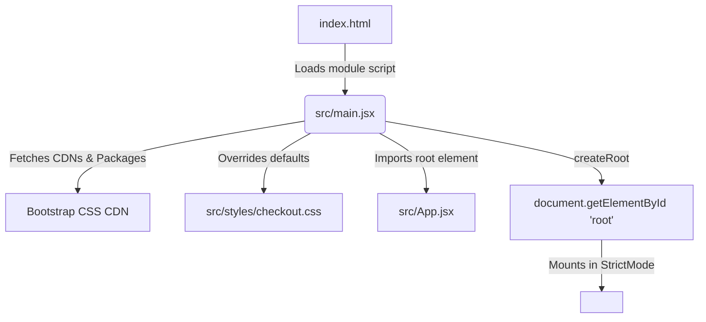

# Architectural Walkthrough: CheckoutFlow Application

This document provides a senior-level architectural walkthrough of the **CheckoutFlow** application. It serves as a study guide to help you articulate the design decisions, component patterns, state management strategy, and styling integrations during a technical interview.

---

## 1. The Entry Point & Initialization Flow

The application initializes through a clean decoupling of the raw HTML container and the React execution environment:



### Key Files and Mounting Mechanism
* **The HTML Shell**: [index.html](file:///c:/Users/malik/Desktop/DigitalHub/CheckoutFlow/index.html) defines a single root container `<div id="root"></div>` and includes the script reference `<script type="module" src="/src/main.jsx"></script>`. It also preconnects to Google Fonts to fetch the primary typography (*Space Grotesk* and *JetBrains Mono*).
* **The JS Entry Point**: [main.jsx](file:///c:/Users/malik/Desktop/DigitalHub/CheckoutFlow/src/main.jsx) bootstraps the React application. It imports the React 18 concurrent-rendering API `createRoot` from `react-dom/client`, targets the `#root` element in the DOM, and renders the `<App />` component wrapped in `<StrictMode>`.
* **CSS Loading and Precedence Order**:
  1. **Bootstrap 5**: Imported via CDN in [index.html](file:///c:/Users/malik/Desktop/DigitalHub/CheckoutFlow/index.html) and imported as a package dependency in [main.jsx](file:///c:/Users/malik/Desktop/DigitalHub/CheckoutFlow/src/main.jsx) for module tree-shaking support.
  2. **Custom Theme**: [checkout.css](file:///c:/Users/malik/Desktop/DigitalHub/CheckoutFlow/src/styles/checkout.css) is imported **after** Bootstrap. This order is critical: it ensures that custom CSS variables (design tokens) and classes can successfully override Bootstrap's default values (e.g., forcing `border-radius: 0 !important` and custom box shadows).

> [!NOTE]
> **No Router/Context Provider**: For a single-purpose linear wizard, adding a heavy client-side router (like React Router) or global state store (like Redux) adds unnecessary complexity. Instead, the application relies on simple state-based conditional rendering and a custom hook.

---

## 2. Component Hierarchy & Navigation

The application is built using a **container-component design pattern**, separating the core stateful logic from presentational rendering.

### High-Level Component Tree

```
App.jsx (Container / State Orchestrator)
 ├── Header (Semantic banner)
 ├── CheckoutStepper (Linear progress indicator)
 └── [Conditional Step Rendering]
      ├── CheckoutSummary   (Step 0: Landing and review items)
      ├── PersonalInfoForm  (Step 1: Contact fields and local validation)
      ├── AddressForm       (Step 2: Shipping/billing address)
      ├── PaymentForm       (Step 3: Card fields and real-time network detection)
      ├── ConfirmationScreen(Step 4: Read-only data summary & submission trigger)
      ├── LoadingOverlay    (Step 5: Fullscreen blocking processing spinner)
      ├── SuccessScreen     (Step 6: Display confirmation ID and reset trigger)
      └── FailureScreen     (Step 7: Display failure feedback, retry, or fallback redirect)
```

### State-Based Conditional Navigation
Instead of route switching via URL paths, navigation is driven by a numerical enum state `step` defined in the custom hook [useCheckoutForm.js](file:///c:/Users/malik/Desktop/DigitalHub/CheckoutFlow/src/hooks/useCheckoutForm.js). 

Inside [App.jsx](file:///c:/Users/malik/Desktop/DigitalHub/CheckoutFlow/src/App.jsx), the application uses a `switch(step)` statement within the `renderStep()` function to mount and unmount components dynamically:

```javascript
const renderStep = () => {
  switch (step) {
    case STEPS.SUMMARY:      return <CheckoutSummary onStart={nextStep} />;
    case STEPS.PERSONAL:     return <PersonalInfoForm data={formData.personal} onChange={updatePersonal} onNext={nextStep} onBack={prevStep} ... />;
    // Additional cases...
  }
}
```

### Parent-to-Child Relationship (Prop Drilling Control)
To demonstrate prop passing, consider the relationship between [App.jsx](file:///c:/Users/malik/Desktop/DigitalHub/CheckoutFlow/src/App.jsx) (Parent) and [PersonalInfoForm.jsx](file:///c:/Users/malik/Desktop/DigitalHub/CheckoutFlow/src/components/PersonalInfoForm.jsx) (Child):

| Prop Name | Type | Purpose | Direction |
| :--- | :--- | :--- | :--- |
| `data` | `Object` | Contains `{ fullName, email, phone }` to pre-populate inputs. | Down (Data flow) |
| `errors` | `Object` | Carries submission validation errors from the custom hook. | Down (Data flow) |
| `onChange` | `Function` | Callback to notify parent of state changes (`updatePersonal`). | Up (Event notification) |
| `onNext` | `Function` | Callback to trigger step validation and progress (`nextStep`). | Up (Event notification) |
| `onBack` | `Function` | Callback to navigate backwards (`prevStep`). | Up (Event notification) |

---

## 3. Representative Function & State Analysis

The core logic of the application is encapsulated in the custom hook [useCheckoutForm.js](file:///c:/Users/malik/Desktop/DigitalHub/CheckoutFlow/src/hooks/useCheckoutForm.js).

### Custom Hook State Variables
* **`step`**: Number. Tracks progress through the wizard index (from `0` to `7`).
* **`formData`**: Object. Grouped into `personal`, `address`, and `payment` subsections. Using a nested object keeps related sections modularized.
* **`errors`**: Object. Tracks validation errors on fields.
* **`cardType`**: Object or `null`. Dynamically derived from the card number value to identify the provider logo and character limits.
* **`referenceNumber`**: String. Populated on a successful submission to present a simulated transaction ID.

### Core Handler Functions and Rerendering
* **Field Updates**: Functions like `updatePersonal` leverage React's functional state update pattern to merge updates without losing adjacent keys:
  ```javascript
  const updatePersonal = useCallback((patch) => {
    setFormData((prev) => ({
      ...prev,
      personal: { ...prev.personal, ...patch },
    }));
  }, []);
  ```
  `useCallback` memoizes these function references, preventing unnecessary component re-renders when children forms receive them as props.
* **Real-time Card Network Detection**: Within `updatePayment`, the card number digits are parsed dynamically to detect the network:
  ```javascript
  if ("cardNumber" in patch) {
    const digits = patch.cardNumber.replace(/\s/g, "");
    setCardType(detectCardType(digits));
  }
  ```

### Asynchronous Operations and Testing Simulation
The actual payment execution is handled asynchronously using a simulated API request in `submitPayment`:

```javascript
const submitPayment = useCallback(() => {
  submissionAttemptCount += 1;
  goToStep(STEPS.PROCESSING); // Mounts LoadingOverlay

  setTimeout(() => {
    const willSucceed = submissionAttemptCount % 2 !== 0; // Alternates success/failure
    if (willSucceed) {
      setReferenceNumber(generateReferenceNumber());
      goToStep(STEPS.SUCCESS);
    } else {
      goToStep(STEPS.FAILURE);
    }
  }, 2500); // 2.5s network simulation delay
}, [goToStep]);
```

> [!TIP]
> **Interview Talking Point**: Mention the **alternating QA testing mechanism** inside `submitPayment` (using a module-level persistent counter `submissionAttemptCount`). Explain how it allows testers to experience both the success and error screen transitions deterministically without needing mock flag toggles or code rebuilds.

---

## 4. Bootstrap 5 Integration

The styling layer uses Bootstrap 5 classes combined with a Neo-Brutalist override system to achieve high visual impact and responsiveness.

### Style Structure Example: `PersonalInfoForm.jsx`
Looking at the layout of [PersonalInfoForm.jsx](file:///c:/Users/malik/Desktop/DigitalHub/CheckoutFlow/src/components/PersonalInfoForm.jsx):

* **Form Fields Grid & Spacing**:
  * Fields are separated vertically using the utility class `.mb-4` (margin-bottom `1.5rem` / `var(--nb-space-lg)`) to prevent dense, clustered forms.
  * Labels utilize `.form-label` to apply standard tracking and block display.
* **Input Elements**:
  * Inputs are styled with `.form-control`.
  * Dynamic validation states hook into Bootstrap's validation pseudo-classes using template literals:
    ```javascript
    const inputClass = (field) =>
      `form-control ${getError(field) ? "is-invalid" : touched[field] && !getError(field) ? "is-valid" : ""}`;
    ```
    * If there's an error, `.is-invalid` triggers a crimson border style.
    * If valid and touched, `.is-valid` styles the field green.
  * Inline validation errors are displayed using `.invalid-feedback d-block` to override display settings and guarantee the visibility of error alerts under all viewport constraints.
* **Flexbox Action Row**:
  * Navigation controls at the bottom are aligned using:
    ```html
    <div className="d-flex justify-content-between gap-3 form-actions">
    ```
    This utilizes flexbox layout (`.d-flex`) to anchor the **Back** and **Continue** buttons at opposite edges (`.justify-content-between`) with a responsive gap (`.gap-3`).

### How Custom CSS Overrides Bootstrap
In [checkout.css](file:///c:/Users/malik/Desktop/DigitalHub/CheckoutFlow/src/styles/checkout.css), the developer targets Bootstrap classes directly using `!important` to lock in a Neo-Brutalist design language:

```css
/* Custom properties override default Bootstrap borders, shapes, and shadows */
.form-control,
.form-select {
  border: 3px solid var(--nb-border) !important;
  border-radius: 0 !important; /* Forces sharp corners instead of Bootstrap's rounded corners */
  box-shadow: var(--nb-shadow-sm); /* Implements thick offset shadow */
}

.btn {
  border-radius: 0 !important;
  border: 3px solid var(--nb-border) !important;
}

.btn-primary {
  background: var(--nb-primary) !important;
  color: var(--nb-primary-text) !important;
  box-shadow: var(--nb-shadow-sm);
}
```
This demonstrates a practical styling approach where Bootstrap is used for structure (grid, flex alignment, validation layout) while CSS variables are used for appearance (shadows, flat edges, high-contrast colors).
